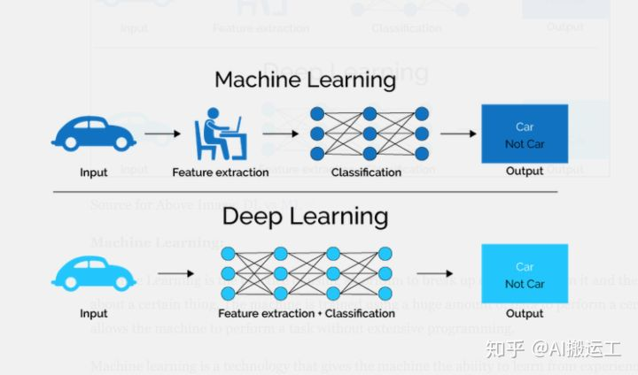

# 人工智能、机器学习、深度学习关系 #
知乎帖子地址：
[https://www.zhihu.com/question/57770020](https://www.zhihu.com/question/57770020)
##一. 三者关系##
人工智能是为机器赋予人的智慧，机器学习是实现人工智能的方法，深度学习是实现机器学习的技术

同心圆表示包含关系：

研究分支示意：

机器学习与深度学习的实现机制区别

# 二.人工智能#
目前来说，人工智能被分为：强人工智能（General AI）和弱人工智能（Narrow AI）。

「强人工智能」就是实现一台机器，让它拥有人类的智慧，人类的感知，可以思考，甚至于超越人类的智慧，这种情景，就像是我们看的科幻剧一样。

「弱人工智能」则是可以像人类一样完成某些具体任务，有可能比人类做得更好，例如：人脸识别，文本审阅等。

# 三.机器学习 #
机器学习的最基本做法，便是使用算法来对数据进行解析、学习，然后对真实世界中的数据/事件作出决策/预测。

根据**使用算法**的不同，机器学习的算法可包括：决策树、聚类、支持向量机、朴素贝叶斯等。

根据**学习方法**的不同，机器学习可以分为：监督学习、半监督学习、无监督学习、集成学习等。使用这些机器学习的算法，人们已经在某些领域上实现了人工智能的发展，但是，仍然存在着某些不易解决的问题。

机器学习（ML）技术在预测中发挥了重要的作用，ML经历了多代的发展，形成了具有丰富的模型结构，例如：

1.线性回归。

2.逻辑回归。

3.决策树。

4.支持向量机。

5.贝叶斯模型。

6.正则化模型。

7.模型集成（ensemble）。

8.神经网络。

这些预测模型中的每一个都基于特定的算法结构，参数都是可调的。训练预测模型涉及以下步骤：

1.  选择一个模型结构（例如逻辑回归，随机森林等）。
2.  用训练数据（输入和输出）输入模型。
3.  学习算法将输出最优模型（即具有使训练错误最小化的特定参数的模型）。

# 四.深度学习 #
一个神经元只能识别一个东西,比如,当你训练给感知器会 认 数字 8 ,你给它看任何一个数字,它就会告诉你,这是 8 还不是 8

 为了让机器识别更多更复杂的图像,我们就需要用更多的神经元，人的大脑由 1000 亿个神经元构成,人脑神经元组成了一个很复杂的三维立体结构, 这么复杂的连接在芯片上做不出来 所以只能简化, 三维太复杂,我们就只能两维,神经元不能到处去连接,我们把它们分层,只允许每一层的神经元连接下一层的

 最初科学家只做出了单层的神经网络,后来做出了双层 而多层神经网络的突破发生在 2012 年,在每年一次的图像识别大赛 Image Net 比赛中,多伦多大学的杰弗里·辛顿(Geoffrey Hinton)教授, 就是 2019 年图灵奖的获得者之一,和他的博士生阿列克斯·克里杰夫斯基(Alex Krizhevsky)使用神经网络的机器学习,令图像识别的准确率大幅突破了原先人们认为的极限 

这个博士生阿列克斯用的 AlexNet 的神经网络有 5 层,而三年后微软研究院的 Resnet 神经网络到了 152 层 层数越越多就能学会认越复杂的图形,比如人脸 X-光片子等 所谓神经网络就是像这张图,把很多神经元一层层连接起来 多层的神经网络,我们就它叫**深度学习**

DNN的主要区别在于，你可以将原始信号（例如RGB像素值）直接输入DNN，而不需要创建任何域特定的输入功能。通过多层神经元（这就是为什么它被称为“深度”神经网络），DNN可以“自动”通过每一层产生适当的特征，最后提供一个非常好的预测。这极大地**消除了寻找“特征工程”的麻烦**，这是数据科学家们最喜欢看到的。

#总结#
深度学习，作为目前最热的机器学习方法，但并不意味着是机器学习的终点。起码目前存在以下问题：

1. 深度学习模型需要大量的训练数据，才能展现出神奇的效果，但现实生活中往往会遇到小样本问题，此时深度学习方法无法入手，传统的机器学习方法就可以处理；
2. 有些领域，采用传统的简单的机器学习方法，可以很好地解决了，没必要非得用复杂的深度学习方法；
3. 深度学习的思想，来源于人脑的启发，但绝不是人脑的模拟，举个例子，给一个三四岁的小孩看一辆自行车之后，再见到哪怕外观完全不同的自行车，小孩也十有八九能做出那是一辆自行车的判断，也就是说，人类的学习过程往往不需要大规模的训练数据，而现在的深度学习方法显然不是对人脑的模拟。
